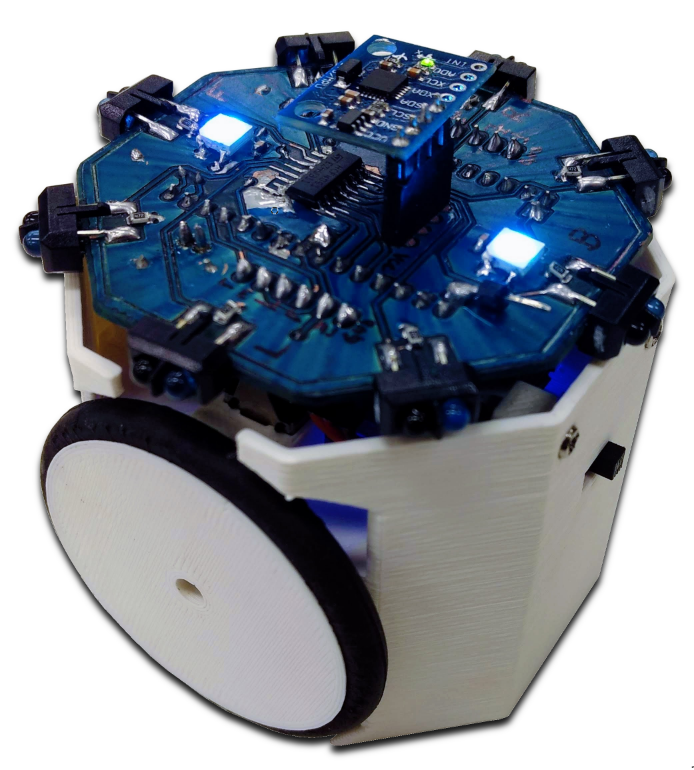
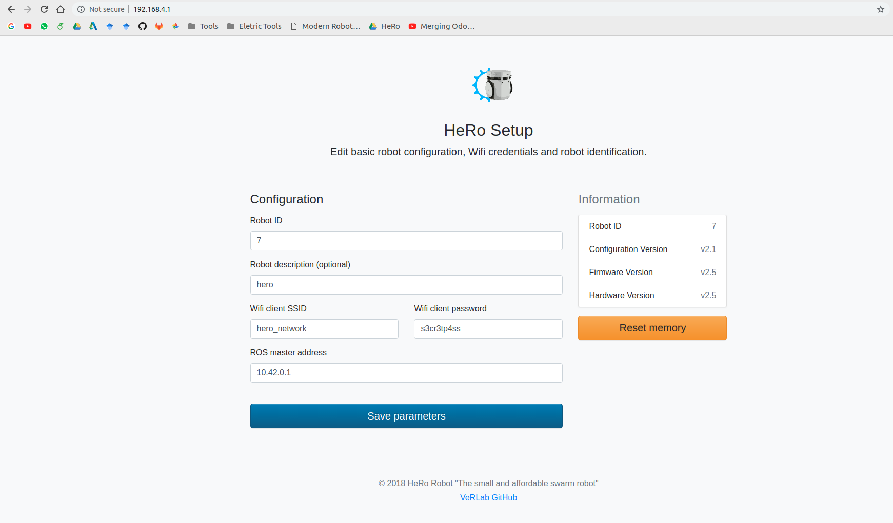

# HeRo: An Open Platform for Robotics Research and Education


This project contributes to an open source ROS-based framework for swarm robotics. We propose an low cost, high availability swarm system that could be printed and assembled multiple times without special knowledge or hardware skills.


# Authors:
- [Paulo Rezeck](https://github.com/rezeck)
- [Hector Azpurua](https://github.com/h3ct0r)
- [Maurício Ferrari](https://github.com/mauferrari)

# Features
- Wheels Encoders (Odometry)
- Inertial Motion Unit (IMU)
- 8x Long-range IR proximity sensors (20 cm)
- 2x Addressable RGBA LED
- Long-time Autonomy 3-9 hours (1800 mA LiPo Battery)
- PID speed control
- General Purpose Bus on top (I2C/Serial/IO)
- Communication Improves
- Setup via Web Interface
- Smaller Design
- ROS Compatible
- Open Hardware and Software

# Dependencies
- ROS Kinect (http://wiki.ros.org/kinetic/Installation)
- Rosserial (http://wiki.ros.org/rosserial)
- Arduino IDE (to install the ESP8266 firmware)

# How to install HeRo common node
- Using git (or download the zip file) clone this repository into ros workspace.
```
$ git clone https://github.com/verlab/hero_common.git
```
- Compile with: 
```
$ catkin_make # or catkin build
```
- Fixing package dependencies:
```
$ rosdep install hero_common
```

# How to install the firmware
- Open the arduino IDE.
- Go to preferences:
 - Change the sketchbook location to access the folder firmware.
 - Add (http://arduino.esp8266.com/stable/package_esp8266com_index.json) to Additional Boards Manager URLS.
 - Restart the IDE.
- Go to Sketchbook/hero/firware

## Robots Firmware
- Open the robot code inside the sketchbook.
- All configuration parameters are available at config.h
  - WiFi Essid and password for connection with ROS master
  - Robot ID
- Connect HeRo at USB and upload the code.

## Web Interface for Configuration
- Once installed the firmware, you do not need to re-burn it ever time in case you want to change some parameters
- Cover all the IR proximity with your hand and turn on the robot (You will note a purple LED blinking)
- The robot will create a WiFi access point where you should connect to change the main coonfiguration
- i.e HERO_ROBOT_A272
- Default password is "s3cr3tp4ss"
- After connect go to your browser and type the [address](http://192.168.4.1:80)
- After change the parameters save and reset the robot


# How to start the ROS node
- Run the hero_bringup.launch file with:
```
$ roslaunch hero_bringup hero_bringup.launch
```
- Turn all the robots on.

## Teleop Demo
- Run the hero_teleop.launch file to control it and set the specific robot id:
```
$ roslaunch hero_bringup hero_teleop.launch id:=3
```

## Available Topics
```
$ rostopic list
/hero_3/cmd_vel
/hero_3/encoder
/hero_3/imu
/hero_3/laser
/hero_3/led
/hero_3/motor
/hero_3/odom
/tf
```

## Available Services
```
$ rosservice list
/hero_3/pid_calibration
/hero_3/set_frequency
/hero_3/set_odom
/hero_3/set_pid_parameters
```

# Some Videos
[](http://www.youtube.com/watch?v=foQDcUG9Arg "Video Title")
