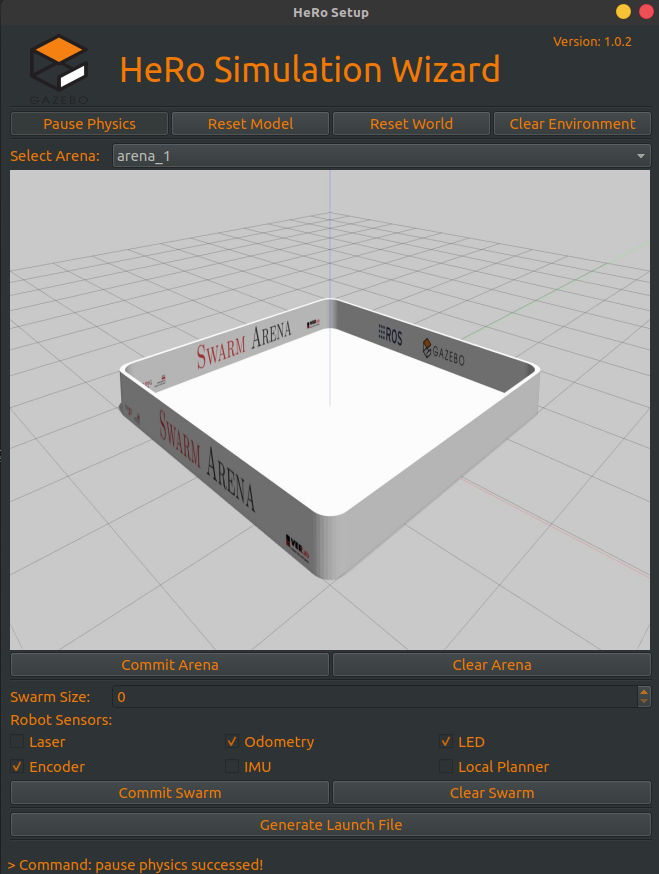
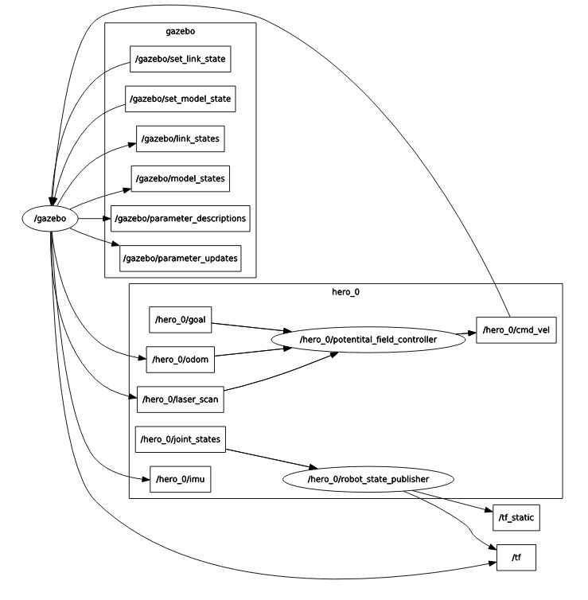
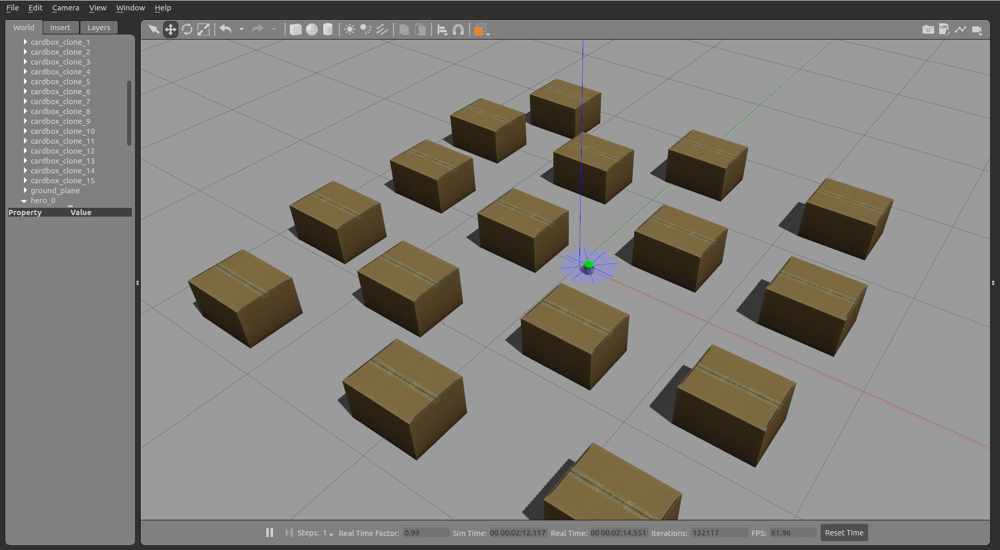
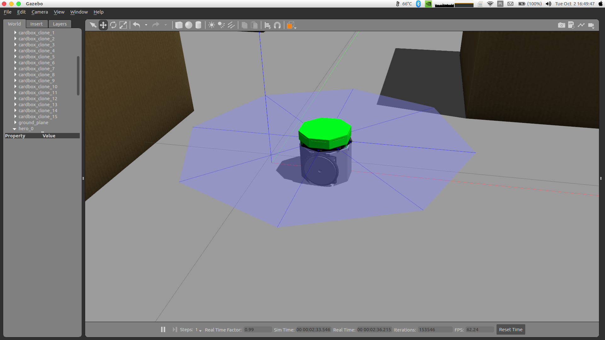
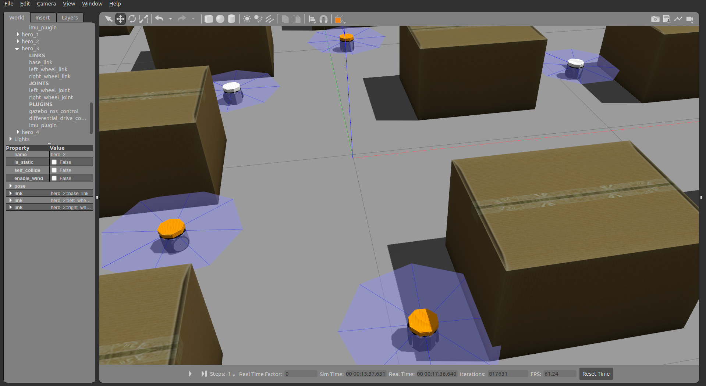
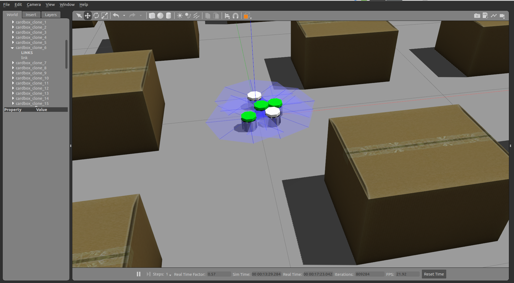

# Gazebo Simulations
We provide HeRo simulations on Gazebo.


## HeRo Wizard
We create a high-level UI interface that should help others to instantiate a gazebo environment.
Its is a simple wizard software that help select an environment and the robots. 
After selecting, and commit the object, they should appear on gazebo were we can drag them and place them wherever we want.
Finally, generate a launch file that compile this setup.

To create a environment, use this launch file:
```sh
$ roslaunch hero_gazebo gazebo_wizard.launch
```
It will open gazebo and this UI interface:



### Steps:

1. Select the arena in the list (see figure);
2. By clicking on commit arena button, the object will be instantiate on gazebo. Clear arena button should remove it.
3. Select the number of robots.
4. Select the sensors available for the robots.
5. By clicking on commit swarm button, the robots will be instantiate on gazebo. Clear swarm will remove them.
6. By using gazebo simulator, make adjustments on the scene, and using the Generate Launch File button will compile the scene in a launch file for future uses.

To launch a pre-set environment, use this launch file:
```sh
$ roslaunch hero_gazebo env_spawn.launch
```


## Features
- Differential drive controller
- Odometry
- IMU
- IR Proximity range (simulated with laser)



## How to use
- Open the terminal and type the following command. This command will initiate Gazebo and spawn on HeRo using potential field controller as an example.
```sh
$ roslaunch hero_gazebo gazebo_bringup.launch 
```



- If you want to spawn another robot, just use the following command. It's important set the argument id for every robot that you spawn.
```sh
$ roslaunch hero_gazebo hero_spawn.launch id:=1 y:=-0.8 x:=1.8
```



## Configurations
Feel free to disable some unusable sensors. I believe that the easy way to do that is commenting some includes on robot.urdf.xacro, in hero_descriptions. For example, the following hero description will disable the imu and laser.
```xml
<?xml version="1.0"?>
<robot xmlns:xacro="http://www.ros.org/wiki/xacro" name="hero_0">
  <!-- Properties  -->
  <xacro:include filename="$(find hero_description)/urdf/common.xacro" />
  <!-- Initiate HeRo model and controller -->
  <xacro:include filename="$(find hero_description)/urdf/hero.xacro" />
  <xacro:include filename="$(find hero_description)/urdf/hero.gazebo.xacro" />
  <xacro:include filename="$(find hero_description)/urdf/hero.transmissions.xacro" />
  <!-- Initiate Laser and IMU sensors -->
  <!--xacro:include filename="$(find hero_description)/urdf/laser.xacro" /-->
  <!--xacro:include filename="$(find hero_description)/urdf/laser.gazebo.xacro" /-->
  <!--xacro:include filename="$(find hero_description)/urdf/imu.gazebo.xacro" /-->

</robot>
```
