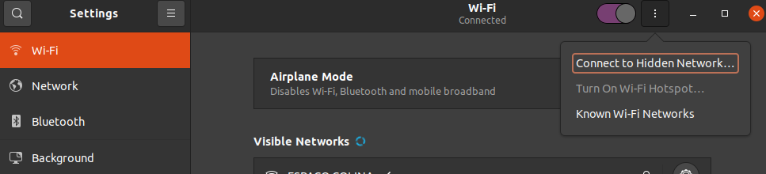
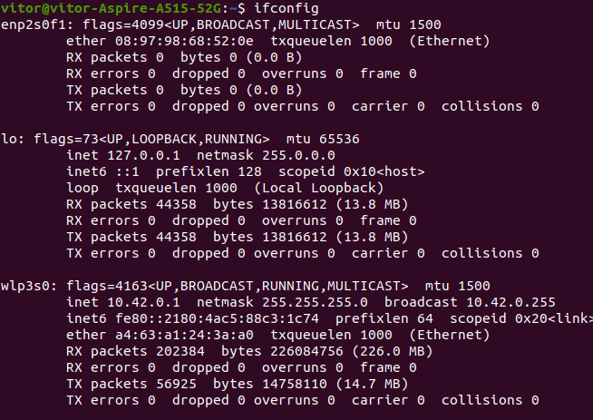
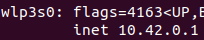

# Connecting Hero and your computer
- Create a hotspot in your computer, follow this guide https://www.how2shout.com/how-to/2-ways-to-create-wifi-hotspot-in-ubuntu-20-04-lts-focal-fossa.html

- In Ubuntu 20.04 there are some bugs when you try to create a hotspot for the first time, maybe it will be blocked as in the screenshot. To resolve this you just need to change tabs in Settings, for example click in Network and then click back in Wifi.


- Run ifconfig to get your IP



- Turn off hotspot

- Turn on Hero while all sensors are covered, the RGB Led will be flashing pink

- Connect your computer in a WIFI called "HERO_ROBOT_???" (password: s3cr3tp4ss)

- Open this link in your web browser http://192.168.4.1/ and configure your_wifi_password. It must be the same SSID and password as the WIFI hotspot


- Save and turn off Hero

- Turn on Hotspot

- Turn on Hero. Hero will be flashing red. If it was configured correctly, it will flash Blue and the RGB Led will turn off. The following video shows how this process works in practice.
[Video]

- Once Hero is connected with your computer, you won't need to configure it again. (Just if you change your computer's WIFI hotspot configuration). So, everytime you want to use Hero you must turn on your computer's WIFI hotspot.


# How to start a ROS Node
- Run roscore (keep it running)
```
$ roscore
```

- In another terminal, run the hero_bringup.launch file with: (keep it running)
```
$ roslaunch hero_bringup hero_bringup.launch
```

- Turn on the Robot(s)


## Teleop Demo
- In another terminal, run hero_teleop.launch file to move Hero around, you must set the specific robot id:
```
$ roslaunch hero_bringup hero_teleop.launch id:=3
```

## Available Topics
```
$ rostopic list
/hero_3/cmd_vel
/hero_3/encoder
/hero_3/imu
/hero_3/laser
/hero_3/led
/hero_3/motor
/hero_3/odom
/tf
```

## Available Services
```
$ rosservice list
/hero_3/pid_calibration
/hero_3/set_frequency
/hero_3/set_odom
/hero_3/set_pid_parameters
```

# Some Videos
[](http://www.youtube.com/watch?v=foQDcUG9Arg "Video Title")


# Reference
Rezeck, Paulo AF, Hector Azpurua, and Luiz Chaimowicz. "HeRo: An open platform for robotics research and education." 2017 Latin American Robotics Symposium (LARS) and 2017 Brazilian Symposium on Robotics (SBR). IEEE, 2017.

```
@inproceedings{rezeck2017hero,
  title={HeRo: An open platform for robotics research and education},
  author={Rezeck, Paulo AF and Azpurua, Hector and Chaimowicz, Luiz},
  booktitle={2017 Latin American Robotics Symposium (LARS) and 2017 Brazilian Symposium on Robotics (SBR)},
  pages={1--6},
  year={2017},
  organization={IEEE}
}
```


# Creative Commons
<a rel="license" href="http://creativecommons.org/licenses/by-nc-nd/4.0/"></a><br />This work is licensed under a <a rel="license" href="http://creativecommons.org/licenses/by-nc-nd/4.0/">Creative Commons Attribution-NonCommercial-NoDerivatives 4.0 International License</a>.
